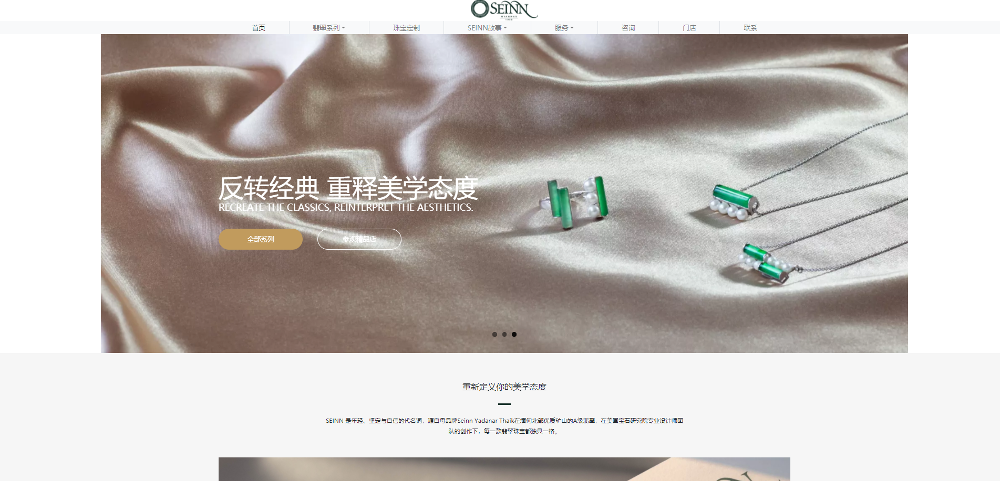
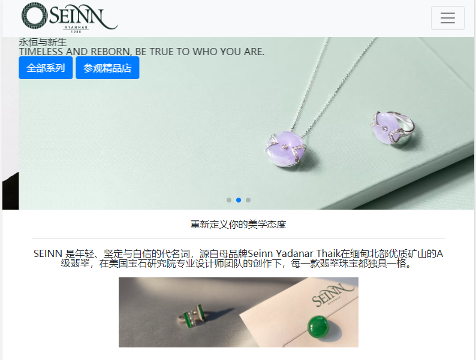

# Jewelry marketing website

This is a project to clone a existing Jewelry website, to see the original website, please go to [seinnjade.com](https://www.seinnjade.com/)
Below is the clone website

## feature :wrench:

Here are some feature my website have:

### 1.navbar dropdown on hover

* Implemented by using bootstrap responsive navbar
* dropdown when hover.
* has a megamenu

### 2.slider with pagination

* Implemented by using jQuery plugin [flexslider](http://flexslider.woothemes.com/index.html)
* autoplay and loop every 3 seconds

### 3. popup Image/video display

* Implemented by using jQuey plugin [Magnific Popup](https://dimsemenov.com/plugins/magnific-popup/)
* click on the picture and then popup a new window

### 4. change content on hover

* Implemented by JavaScript with html using `onmouseover` attribute
* hover the icon and the below content would change

### 5. hover animation and hover show decoration

* Implemented with pure css and html
  
## Responsive Strategy :iphone:

- In this clone website, there are a lot of elements have fixed width and height since i want to make the website look likes the original one, that's make it hard when i am tring to make it fit into mobile browser.
- Also, i am very pleased with the current website appearance in wide screen width.
- Last but not least, some hover effect need to be removed/changed on a mobile device, because there has no 'hover' when using mobile.
- So, instead of intergrating `@media screen` to index.html, i let it redirect to mobile.html which is design for website when the screen width is smaller than 992px

